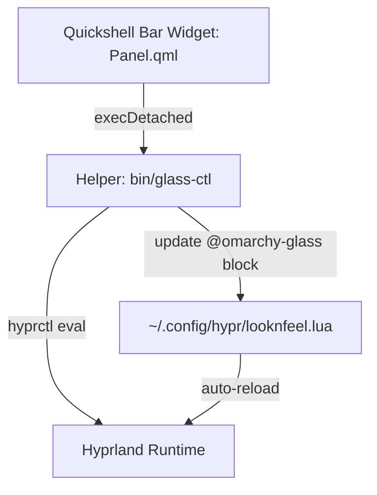

# Omarchy Glass & Blur Control Plugin (`lutfi.glass`)

An interactive quick-control Quickshell bar widget for [Omarchy](https://omarchy.org/) (Arch Linux + Hyprland) to adjust window opacity, frosted glass blur, and top status bar blur in real time.

## Features

- **Live Window Opacity**: Adjust active and inactive window opacity with instant preview.
- **Frosted Glass Blur**: Toggle and tune Hyprland's dual-Kawase blur passes and radius.
- **Top Bar Blur**: Enable or disable glass blur underneath the Omarchy top bar (`omarchy-bar` namespace).
- **Quick Presets**: One-click presets for Solid (100%), Subtle (92%), Frosted (88%), and Deep (78%).
- **Seamless Persistence**: Writes clean overrides inside fenced markers in `~/.config/hypr/looknfeel.lua`.

## Architecture



## Installation

### Via Omarchy Plugin Manager

```bash
omarchy plugin add https://github.com/lutfi-zain/omarchy-glass-blur.git --enable
```

### Manual Installation

Clone this repository directly into your Omarchy plugins directory:

```bash
git clone https://github.com/lutfi-zain/omarchy-glass-blur.git ~/.config/omarchy/plugins/lutfi.glass
```

Then add `lutfi.glass` to your `~/.config/omarchy/shell.json` in the `bar.layout.right` (or preferred) section:

```json
{
  "id": "lutfi.glass"
}
```

Reload plugins in the shell:

```bash
omarchy-shell shell rescanPlugins
```

## Requirements

- [Omarchy](https://omarchy.org/) Quattro with Quickshell
- [Hyprland](https://hyprland.org/) with Lua configuration support
- Python 3

## License

MIT License &copy; 2026 Lutfi Zain
